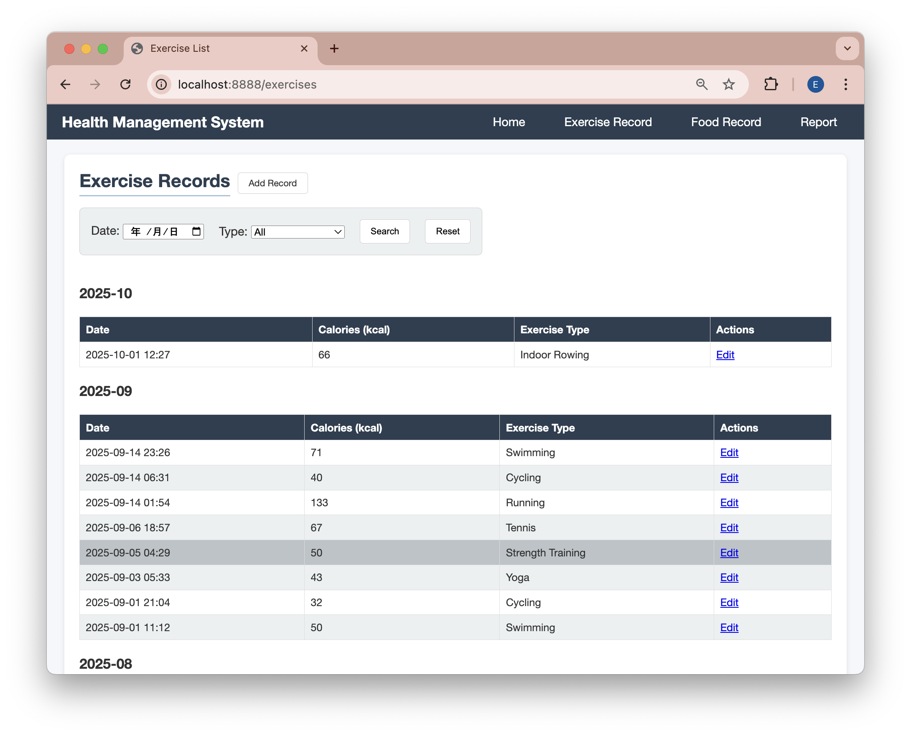
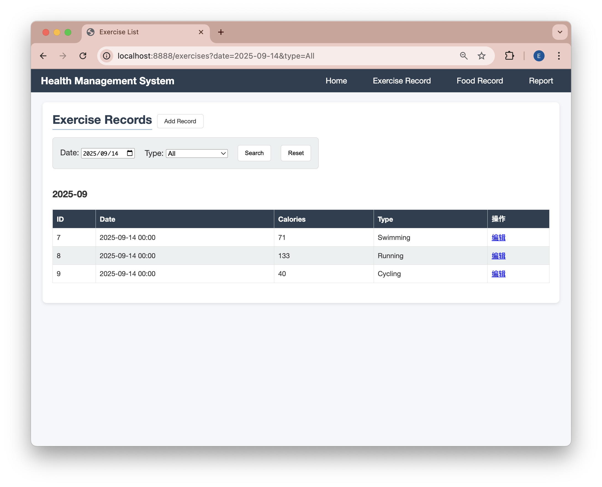
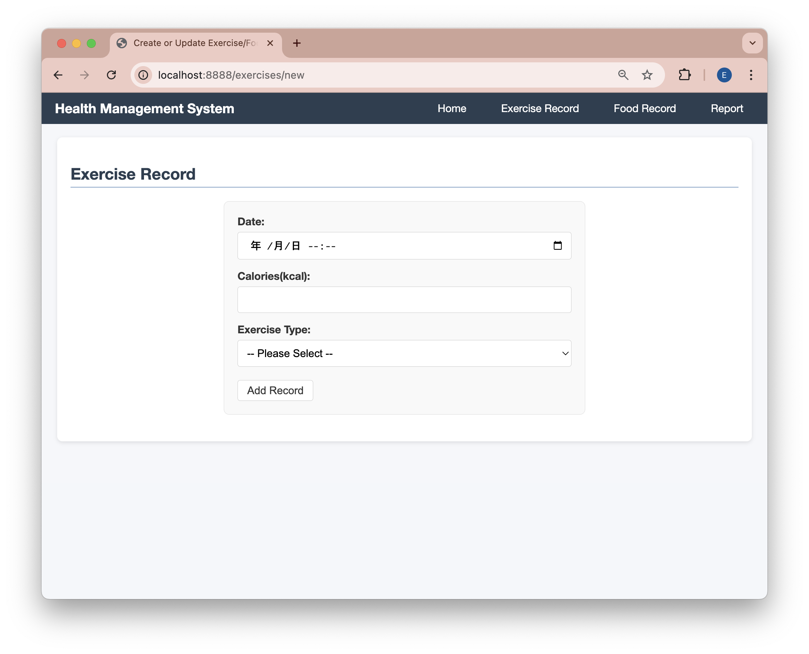

# 運動・食事管理システム (Health-Manage System)

## プロジェクト概要
このシステムは、日々の運動・食事を記録し、摂取カロリーと消費カロリーを可視化することで、健康的な生活を支援することを目的としています。  
バックエンドには **Spring Boot**、フロントエンドにはThymeleaf + Chart.jsを用い、シンプルかつ拡張可能な構成を実現しています。

## 主な機能
- 運動記録（種類・時間・消費カロリーなど）
- 食事記録（食品名・摂取カロリーなど）
- 日・週単位での統計グラフ表示
- データの検索・編集・削除

## 技術スタック
- **バックエンド**: Spring Boot + H2 Database
- **データ管理**: Spring Data JPA
- **フロントエンド**: HTML (Thymeleaf), Chart.js
- **ビルドツール**: Gradle

## ローカルにセットアップ方法
```bash
# リポジトリをクローン
git clone https://github.com/inki-luo/health-manage-system
cd health-manage-system
./mvnw package
java -jar target/*.jar
```
[http://localhost:8888](http://localhost:8888)からトップページをアクセスできます。


## その他の画面
### 運動記録の検索結果
+ 記録した運動データを一覧表示する画面です。  
日付・運動の種類・消費カロリーなどを確認できます。

検索条件を入れ、`search`ボタンをクリックすると、絞り込み結果が表示されます。


### 運動記録フォーム
+ 新しい運動記録を追加する画面です。  
運動の種類、時間、消費カロリーを入力して保存します。

