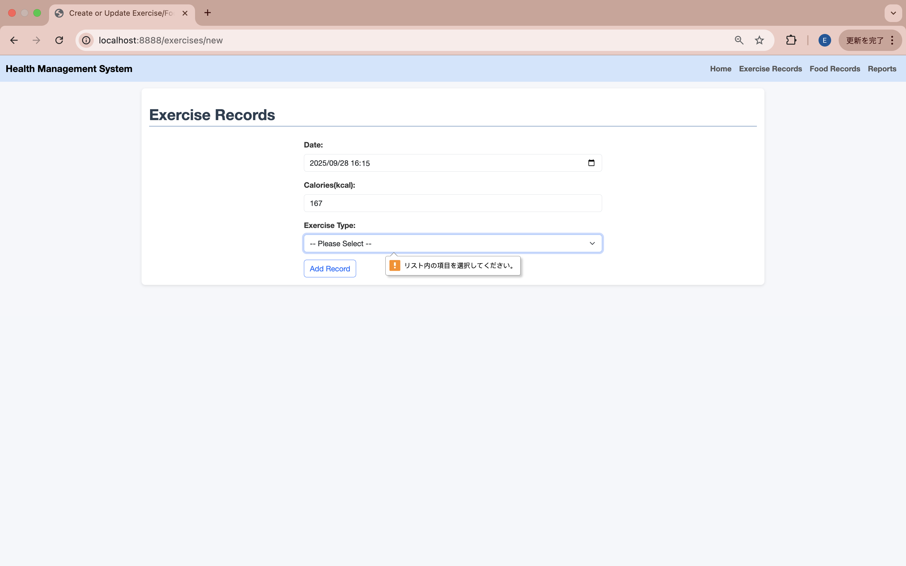

# 運動・食事管理システム (Health-Manage System)

## プロジェクト概要
このシステムは、日々の運動・食事を記録し、摂取カロリーと消費カロリーを可視化することで、健康的な生活を支援することを目的としています。  
バックエンドには **Spring Boot**、フロントエンドにはThymeleaf + Chart.jsを用い、シンプルかつ拡張可能な構成を実現しています。

## 主な機能
- 運動記録（種類・時間・消費カロリーなど）
- 食事記録（食品名・摂取カロリーなど）
- 日・週単位での統計グラフ表示
- データの検索・編集・削除

## 技術スタック
- **バックエンド**: Spring Boot + MySQL
- **データ管理**: Spring Data JPA
- **フロントエンド**: HTML (Thymeleaf), Chart.js
- **ビルドツール**: Maven

## ローカルにセットアップ方法
```bash
# リポジトリをクローン
git clone https://github.com/inki-luo/health-manage-system
cd health-manage-system
./mvnw package
java -jar target/*.jar
```
[http://localhost:8888](http://localhost:8888)からトップページをアクセスできます。


## 機能
### 運動記録の検索結果一覧
+ 記録した運動データを一覧表示する画面です。
  + 日付・運動の種類・消費カロリーなどを確認できます。
  
  + 検索条件を入れ、`search`ボタンをクリックすると、絞り込み結果が表示されます。
  
  


### 運動記録の操作
+ 新しい運動記録を追加 
  + 運動記録一覧画面の`Add Record`ボタンを押すと、運動記録を追加するフォームに移ります。運動の種類、時間、消費カロリーを入力して保存すると、運動記録一覧画面に戻り、新しく追加された記録が確認できます。
  
+ 運動記録を修正
  + 各記録の`Edit`ボタンを押すと、運動記録を編集するフォームに移ります。運動の種類、時間、消費カロリーを編集して保存すると、運動記録一覧画面に戻り、編集された記録が確認できます。

+ 運動記録を削除
  + 各記録の`Delete`ボタンを押すと、ダイアログで再確認を行なって`OK`を押すと記録が削除されます。
    